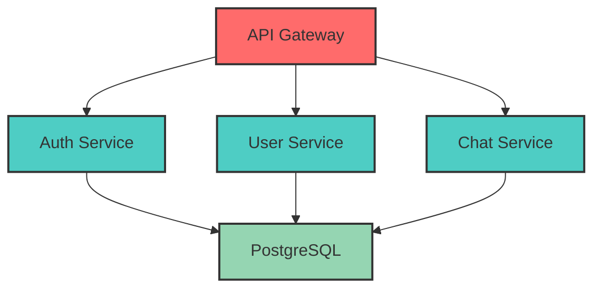

# Архитектура микросервисов

## Mermaid диаграмма

## Описание компонентов

### API Gateway
- 🚪 Входная точка для всех клиентских запросов
- Маршрутизация запросов к соответствующим микросервисам
- Аутентификация и авторизация на уровне шлюза

### Auth Service
- 🔐 Управление аутентификацией пользователей
- Генерация и валидация JWT токенов
- Регистрация и вход пользователей

### User Service
- 👤 Управление профилями пользователей
- Хранение пользовательских данных
- CRUD операции для пользователей

### Chat Service
- 💬 Обработка сообщений в чатах
- Управление комнатами и каналами
- История переписок

### PostgreSQL
- 🗄️ Централизованная база данных
- Хранение данных всех сервисов
- ACID транзакции и надежность

## Поток данных

1. Клиент отправляет запрос на API Gateway
2. Gateway маршрутизирует запрос к нужному сервису
3. Сервис обрабатывает бизнес-логику
4. Данные сохраняются/читаются из PostgreSQL
5. Ответ возвращается через Gateway клиенту